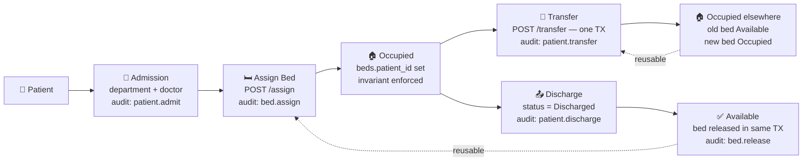
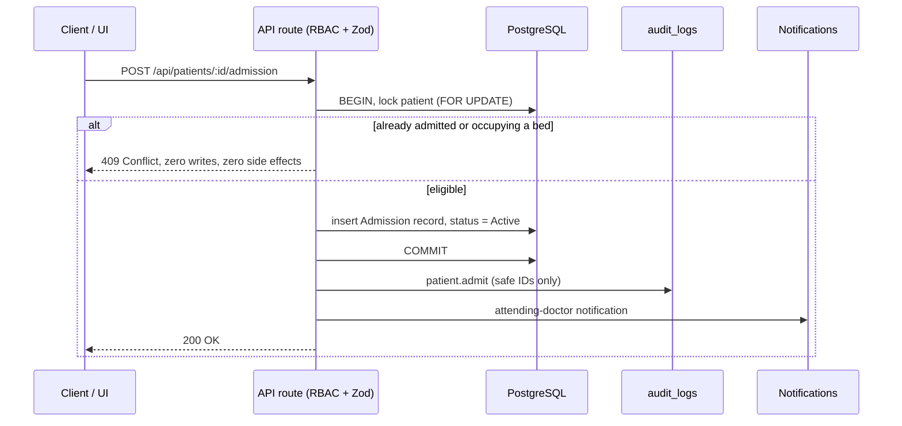

<div align="center">

# 🏥 MedCore Enterprise

### The Hospital Management System — built like a product, not a project.

**A production-grade, full-stack HMS with real workflows — authentication, RBAC, clinical records, billing & insurance, pharmacy, lab, surgery, emergency, and a live inpatient bed lifecycle.**


</div>

---

## 📊 At a Glance

<div align="center">

| | | | | |
|:--:|:--:|:--:|:--:|:--:|
| **20** | **52** | **32** | **22** | **9** |
| [Modules](#modules) | API Routes | Pages | DB Tables | RBAC Roles |
| **79** | **41** | **1,549** | **0** |
| Components | Permission Keys | Automated Checks | Build Errors |

</div>

---

## 🎯 Why MedCore?

Most portfolio HMS projects stop at CRUD screens with fake data. MedCore goes further:

- **🔒 Real security** — every API is authenticated and permission-checked server-side; UI gating is a convenience, the backend is the source of truth.
- **🔁 Real workflows** — admit → assign bed → occupy → transfer → discharge → release, with transactional integrity, deadlock-safe locking, and audit trails.
- **🧾 Real billing** — invoices, payments, insurance claims, approvals — computed from actual line items, never hard-coded.
- **🧪 Really tested** — 1,549 automated checks across 17 regression suites (API contracts, RBAC matrices, DB integrity, concurrency races, notification delivery, static source gates), plus strict `tsc`, ESLint, and production build gates. The suites run from a local harness outside this repository; the committed gates are `tsc`, lint, and build.
- **🚫 Zero fake data in the UI** — dashboards, ward views, and shift summaries are computed from live queries.

---

## 🧰 Tech Stack

| Layer | Choice |
|-------|--------|
| **Framework** | Next.js 16 (App Router, Server Actions, route handlers) |
| **Language** | TypeScript 5 (strict, `tsc --noEmit` gate) |
| **Styling** | Tailwind CSS v4 + Radix UI primitives |
| **State** | Zustand + TanStack Query |
| **Forms** | React Hook Form + Zod 4 (shared client/server schemas) |
| **Database** | PostgreSQL 18 + Drizzle ORM (type-safe queries, migrations) |
| **Auth** | NextAuth v5 — Credentials provider, JWT sessions, RBAC middleware |
| **Charts** | Recharts |
| **Icons** | Lucide React |

---

## 🗂️ Modules

<details open>
<summary><b>Click to explore all 20 modules</b></summary>

<br>

| # | Module | What it does |
|:-:|--------|--------------|
| 1 | 📊 **Dashboard** | Live KPIs, department status, activity timeline, admissions analytics |
| 2 | 👤 **Patients** | Registry, profiles, allergies, conditions, medications, full records hub |
| 3 | 🩺 **Clinical** | Consultations, prescriptions, vitals, medical records — linked to patient charts |
| 4 | 👨‍⚕️ **Staff** | Doctors & staff directory, departments, scheduling |
| 5 | 📅 **Appointments** | Scheduling, status lifecycle, doctor assignment |
| 6 | 🛏️ **Beds & Rooms** | **Inpatient lifecycle: admission → assignment → occupancy → transfer → discharge → release** |
| 7 | 💗 **Nursing** | Ward patient board, task queue, live shift metrics, quick actions |
| 8 | 💊 **Pharmacy** | Inventory, prescriptions, dispensing workflow |
| 9 | 🧪 **Laboratory** | Orders, results, processing → completion pipeline |
| 10 | 🔬 **Surgery** | OT scheduling, procedure planning |
| 11 | 🚨 **Emergency** | Triage, acuity levels, command center |
| 12 | 💳 **Billing** | Invoices, line items, payments, totals |
| 13 | 🛡️ **Insurance** | Claims, approval workflow, coverage |
| 14 | 📦 **Inventory** | Stock tracking, levels, alerts |
| 15 | 📁 **Records** | Cross-patient records hub with relational details |
| 16 | 🔔 **Notifications** | Per-user inbox with live topbar bell (unread badge) |
| 17 | 📈 **Reports** | Aggregated operational reporting |
| 18 | 🕵️ **Audit Log** | Immutable security audit trail with actor/action/category |
| 19 | 👥 **Users & Roles** | Account management, role assignment |
| 20 | ⚙️ **Settings** | System configuration |

</details>

---

## 🔐 Role-Based Access Control

Nine roles, **41 permission keys**, enforced on every endpoint:

| Role | Typical Access |
|------|----------------|
| 🛡️ **Administrator** | Everything — full control |
| 🩺 **Doctor** | Patients, clinical, appointments, labs, pharmacy, records |
| 💗 **Nurse** | Patients, nursing, beds (read), vitals, ward board |
| 🙋 **Receptionist** | Patient registration, appointments, admissions desk |
| 💊 **Pharmacist** | Pharmacy, inventory, prescriptions |
| 🧪 **Lab Technician** | Laboratory, results |
| 💳 **Billing** | Invoices, insurance, claims |
| 🔪 **Surgeon** | Surgery, patients (read), records |
| 🔒 **Security** | Audit log, read-only oversight |

```ts
// One shared source of truth — server + client
hasPermission(session.user.role, "beds:write")   // ADMIN only
hasPermission(session.user.role, "patients:read") // 5 roles
```

---

## 🔄 Inpatient Bed Lifecycle — the flagship workflow

Admission, occupancy, and discharge are **transactional and audited** — not a status dropdown:



**Guarantees:**
- ♟️ **Deadlock-safe** — consistent lock order: patient row → bed row
- 🚫 **Double-booking impossible** — concurrent assign races resolve to exactly one `200` + one `409`
- 🚫 **One admission per patient** — a second admit while occupying a bed or still admitted → `409`; readmission allowed after discharge
- 🧹 **No orphaned beds** — deleting a patient releases their held bed(s) in the same transaction
- 📏 **Single source of truth** — `beds.patient_id` ⇄ `beds.status` consistency validated in every write path
- 📜 **Append-only audit** — safe identifiers only, never clinical text; every occupancy change emits `bed.assign` / `bed.release` / `patient.transfer`
- ⚖️ **Occupancy cannot be overwritten** via generic `PUT` — workflow endpoints only
- 🔁 **Transfer is atomic** — one transaction frees the source bed and occupies the destination (locks patient first, then both beds by ascending id); concurrent transfers of the same patient or into the same bed resolve to exactly one `200`
- 📨 **Right people notified** — admit/discharge → attending doctor; assign/release (including on patient delete) → ward nurses of the bed's department; transfer → ward nurses of both departments

### One transaction per state change



Failed guards return before any write — no audit rows, no notifications, no partial state. The same pattern covers assign, release, transfer, discharge, and patient delete.

---

## ✅ Quality Gates

| Gate | Result |
|------|--------|
| `npx tsc --noEmit` | ✅ Pass — strict TypeScript, zero errors |
| `npm run lint` | ✅ Pass — 0 errors |
| `npm run build` | ✅ Pass — production build |
| **17 test suites** | ✅ **1,549 / 1,549 checks green** |
| — API contract suites | auth, records, beds, pharmacy, lab, surgery, emergency, billing |
| — Concurrency tests | 8 parallel bed races + 5 transfer races (same patient, same destination ×3, vs release, vs assign) → exactly-one-success, deterministic 409s |
| — DB integrity tests | occupancy invariants, orphan checks, cascade cleanup |
| — Notification delivery | unread-count badge poll, recipient isolation, mark-read badge sync, poll safety |
| — Static source gates | no `console.log`, no fake delays, no mock data in shipped pages |
| **M11-M audit harness** | ✅ **827 / 827 checks green** (responsive sweep, axe, keyboard, states, cross-browser, security) |
| **axe-core (WCAG)** | ✅ **0 violations across 29 routes** |
| **Lighthouse (desktop + mobile)** | ✅ login 100/100/100/100 · dashboard 100/100/100/100 · patients 100/100/100/100 · mobile 96/100/100/100 — all categories > 90 |
| **Error boundaries** | ✅ live-tested 9/9 — root + dashboard loading/error, global-error, friendly 404 |
| **Schema discipline** | ✅ No migration without an approved gate |

---

## 🚀 Quick Start

```bash
# 1. Clone
git clone https://github.com/anuragY77/medcore-enterprise-hms.git
cd medcore-enterprise-hms

# 2. Install
npm install

# 3. Configure
cp .env.example .env.local   # add your PostgreSQL URL

# 4. Migrate + seed
npx drizzle-kit generate
npx drizzle-kit migrate
npx tsx src/lib/db/seed.ts

# 5. Launch
npm run dev
```

Open **[http://localhost:3000](http://localhost:3000)** 🎉

### 🔑 Demo Credentials

| Role | Email | Password |
|------|-------|----------|
| 🛡️ Admin | `admin@medcore.com` | `medcore123` |
| 🩺 Doctor | `doctor@medcore.com` | `medcore123` |
| 💗 Nurse | `nurse@medcore.com` | `medcore123` |
| 🙋 Reception | `reception@medcore.com` | `medcore123` |
| 💊 Pharmacy | `pharmacy@medcore.com` | `medcore123` |

> 💡 Log in as **admin** for the full experience, then switch roles to see RBAC in action — menus, buttons, and API responses all change.

---

## 📁 Project Structure

```
src/
├── app/
│   ├── (auth)/login/           # 🔑 Auth flow
│   ├── (dashboard)/            # 🖥️ 20 authenticated modules
│   │   ├── patients/           #    registry + [id] chart, records, admission, discharge
│   │   ├── appointments/       #    scheduling lifecycle
│   │   ├── beds/               #    inpatient lifecycle UI
│   │   ├── nursing/            #    nurse station
│   │   └── billing|insurance/  #    revenue cycle
│   └── api/                    # ⚡ 52 route handlers (RBAC + validation)
├── components/                 # 🧩 79 reusable components
├── lib/
│   ├── auth.ts                 #    NextAuth + session
│   ├── audit.ts                #    append-only audit writer
│   ├── db/                     #    schema (22 tables) + migrations
│   └── validations/            #    shared Zod schemas
└── types/auth.ts               # 🔐 roles + permission matrix
```

---

## 🗄️ Database

**22 PostgreSQL tables** connected by real foreign keys — patients, staff, appointments, beds, medical records, prescriptions, invoices, claims, inventory, surgeries, emergency cases, audit logs, and more.

- Type-safe through Drizzle ORM end-to-end
- Referential integrity (`ON DELETE` policies) — orphan-free by construction
- Migrations are versioned in `drizzle/`

---

## 🗺️ Roadmap

- [x] Auth, RBAC & audit foundation
- [x] 20 operational modules with live data
- [x] Billing & insurance revenue cycle
- [x] Inpatient bed lifecycle (admission → discharge)
- [x] Bed lifecycle hardening (race-free transactions, double-admission guard, audited + notified)
- [x] Atomic patient transfer (single-transaction release + assign, audited + notified)
- [x] Notification delivery engine
- [x] Phase 13 — testing, responsiveness & polish (accessibility, error boundaries, Lighthouse, cross-browser)
- [ ] Payment gateway integration
- [ ] External HL7/FHIR integrations

---

## 📜 License

Private — All rights reserved.

---

<div align="center">

**Built with obsessive attention to correctness — every claim in this README is backed by automated checks or verified source.**

`★ Star the repo if you find it impressive` · [Report an issue](https://github.com/anuragY77/medcore-enterprise-hms/issues)

</div>
